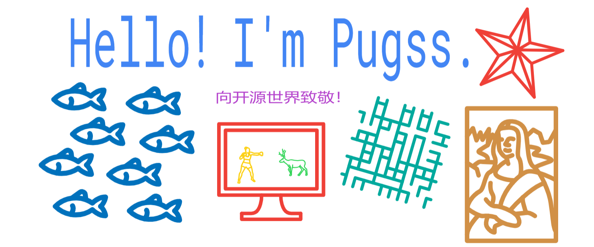

<h1 align="center"> 
</h1>

   

### 🛠 技术栈 | Tech Stack
- 💻 &#160; 
  
  
  
- 🌐 &#160; 
  
  
  
  
- 🛢 &#160; 
  
  
  
- 🔧 &#160;
  
  
  
  
- 💺 &#160;
  
  

- 📼 &#160;
  

#### About me

- 💼 欢迎大家访问 [😍&nbsp;我的主页](http://www.wangxscoding.top/main/)，会时不时分享些有趣🤔的内容

- 📈 Github 主要用于博客和笔记代码托管，[👁‍🗨 Blog 博客地址](http://www.wangxscoding.top/mysite/) 🙏，加油！

- ❤️ 自己很庆幸能给学习编程，从事IT相关工作😁 ，希望后续能继续加油！

- 💬 我自己的 [导航页](http://www.wangxscoding.top/board) 也放出来吧！正事可以来 [📧&nbsp;email](wxs15852445352@163.com)联系我，over！

___
## Welcome! This is the page that has been visited  times!
